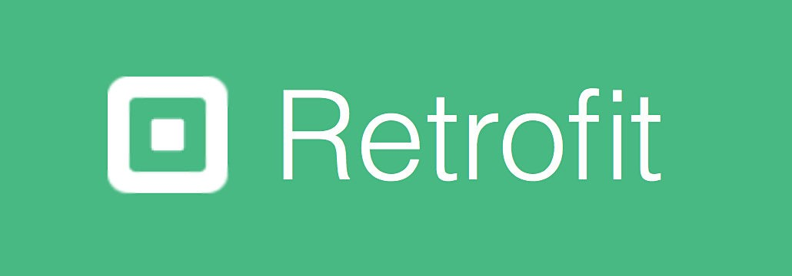

# Application Studio Ghilbi

## Description du projet

Projet de développement mobile de 3ème année à l'ESIEA, utilisant le pattern MVC pour une application Android codée en Java.

L'application StudioGhilbi traite des données reçues au format JSON récupérées via requêtes HTTP GET sécurisées depuis l'API REST
de [ghibliapi.herokuapp.com](https://ghibliapi.herokuapp.com/) relative aux données de tous les films réalisés par le grand studio des films d'animation japonais Studio-Ghilbi. les détails de chaque film, comme l'année de sortie de film, le nom de réalisateur et producteur, ainsi que la note de critique de chaque film.

 <i><legend>Logo de l'application</legend></i>

# Outils et technologies de développement

* Android Studio est un environnement de développement pour développer des applications mobiles Android.

 

* Retrofit2 est une librairie permettant de réaliser des appels à des webservices REST sur 

* SharedPreferences sont des espaces de stockages propres à chaque application Android. Avec un système de clé/valeur, vous pourrez persister vos données facilement

# Consignes respectées :
* Architecture MVC
* Appels REST
* Ecrans : 2 activités, 2 fragments
* Affichage d'une liste dans un RecyclerView
* Affichage du détail d'un item de la liste
* Gitflow propre

# Fonctionnalités:
## Premier Ecran 
* Afficher la liste des films de studio ghilbi

## Deuxième Ecran 
* afficher les details de chaque film(Titre, Année, Producteur, Réalisateur, Note de film...) 

